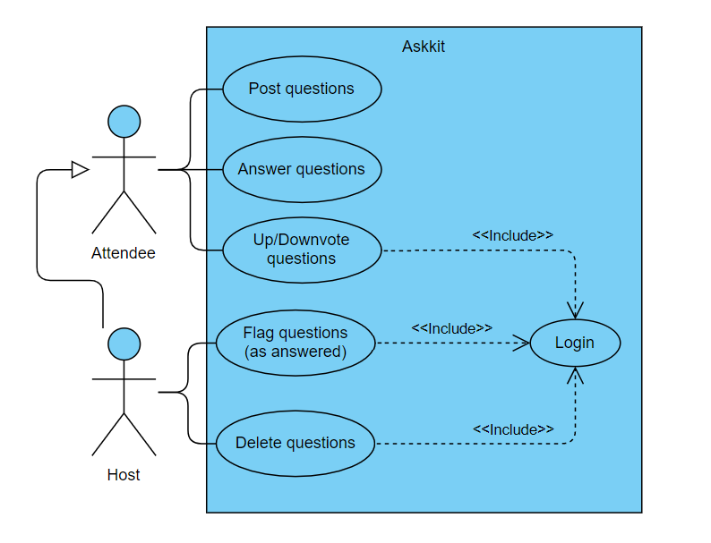
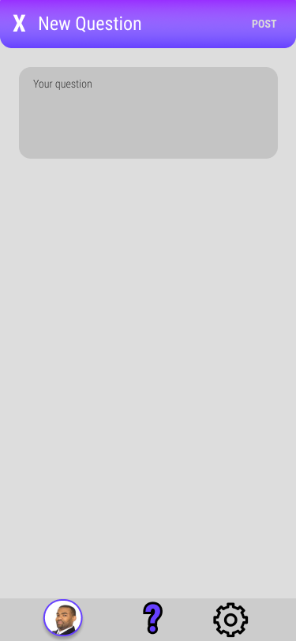
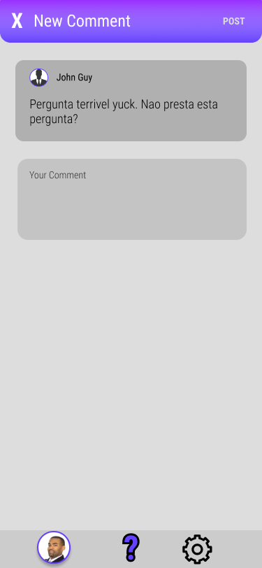

# openCX-jakepaulers Development Report

Welcome to the documentation pages of the Askkit of **openCX**!

You can find here detailed about the (sub)product, hereby mentioned as module, from a high-level vision to low-level implementation decisions, a kind of Software Development Report (see [template](https://github.com/softeng-feup/open-cx/blob/master/docs/templates/Development-Report.md)), organized by discipline (as of RUP): 

* Business modeling 
  * [Product Vision](#Product-Vision)
  * [Elevator Pitch](#Elevator-Pitch)
* Requirements
  * [Use Case Diagram](#Use-case-diagram)
  * [User stories](#User-stories)
  * [Domain model](#Domain-model)
* Architecture and Design
  * [Logical architecture](#Logical-architecture)
  * [Physical architecture](#Physical-architecture)
  * [Prototype](#Prototype)
* [Implementation](#Implementation)
* [Test](#Test)
* [Configuration and change management](#Configuration-and-change-management)
* [Project management](#Project-management)

So far, contributions are exclusively made by the initial team, but we hope to open them to the community, in all areas and topics: requirements, technologies, development, experimentation, testing, etc.

Please contact us! 

Thank you!

*Daniel Brandão, Henrique Santos, João Leite, Pedro Moás*

---

## Product Vision

The goal is to make host-atendee interaction simple. Users post relevant questions and the audience can vote and reply. That way, the talk host may choose to answer the most popular ones.

---
## Elevator Pitch

Most conference Q&A's suffer from a common problem: There is no way for the host to focus on the most relevant questions, so those may end up unanswered. That's why we decided to end this problem, by creating Askkit, a mobile app targeted towards conference atendees that allows them to post their questions for every other user to see. That way, they may vote for the ones they want to see answered, and flag the ones they find less relevant. That way, a speaker can be aware of what topics to tackle during the Q&A session.

---
## Requirements

### Use case diagram 



#### Post Questions:

*  **Actor**. Conference attendee.

*  **Description**. This use case exists so that the attendee can upload their questions into the database to later be answered.

*  **Preconditions and Postconditions**.  In order to post a question, the attendee must first join a talk's page. In the end, the user's question will be added to the database, and displayed on the forum.
  
*  **Normal Flow**. 
	1. The attendee presses the button to add a question to a forum.
	2. The attendee types his question.
	3. If it's within the allowed length, the system saves the question to the database, and displays it on the forum.

*  **Alternative Flows and Exceptions**. 
	1. The attendee presses the button to add a question to a forum.
	2. The attendee types his question.
	3. If the question is too long, the system will respond with an error message.
	4. The user can then retype his question, and proceed as normal.

#### Answer Questions:

*  **Actor**. Conference attendee.

*  **Description**. This use case exists so that an attendee can answer other user's questions.

*  **Preconditions and Postconditions**.  In order to answer a question, the attendee must first join a talk's page. In the end, the user's answer will be added to the database, and displayed as a reply to the chosen question.

*  **Normal Flow**. 
	1. The attendee selects a question he wants to answer.
	2. The attendee types his answer.
	3. If it's within the allowed length, the system saves the answer to the database, and displays it as a reply to the selected question.

*  **Alternative Flows and Exceptions**. 
	1. The attendee selects a question he wants to answer.
	2. The attendee types his answer.
	3. If the answer exceeds the character limit, the system sends and error message.
	4. The user can then retype his answer and proceed as normal.

#### Up/Downvote Questions:

*  **Actor**. Conference attendee.

*  **Description**. This use case exists so authenticated attendees can help filter good and bad questions.

*  **Preconditions and Postconditions**.  In order to up or downvote a question/answer, the attendee must be logged in. After voting, the vote will then be added to the total count.

*  **Normal Flow**. 
	1. The attendee presses the up or downvote button.
	2. If the user is correctly authenticated, the system adds the vote to the respective count, or removes it, if the button had been pressed earlier.

*  **Alternative Flows and Exceptions**. 
	1. The attendee presses the up or downvote button.
	2. If the user isn't logged in, the system will prompt them to do so.
	3. After successfully logging in, the vote is counted, and either added or subtracted (depending on if the button had been previously pressed or not).

#### Flag Questions:

*  **Actor**. Talk host.

*  **Description**. This use case exists so talk hosts can flag questions as having received a satisfactory answer.

*  **Preconditions and Postconditions**.  In order to flag a question, the host must be logged in. In the end, the question will be marked as answered, with the answer in question highlighted.

*  **Normal Flow**. 
	1. The host chooses a question.
	2. The host, as an attendee, posts an answer to the question.
	3. If the host is correctly logged in, they can highlight their own answer, and the system will flag the question as answered.

*  **Alternative Flows and Exceptions**. 
	1. The host chooses a question.
	2. The host, as an attendee, posts an answer to the question.
	3. If the host isn't correctly logged in, the system will prompt them to do so.
	4. After logging in, they can proceed as normal.
*  **OR** 
	1. The host chooses a question.
	2. The host, chooses an answer he finds adequate.
	3. If the host is correctly logged in, they can highlight the answer, and the system will flag the question as answered.
	
#### Delete Questions:

*  **Actor**. Talk host.

*  **Description**. This use case exists so talk hosts can delete questions that are not relevant to the topic at hand.

*  **Preconditions and Postconditions**.  In order to delete a question, the host must be logged in. In the end, the selected question will be removed.

*  **Normal Flow**. 
	1. The host chooses a question.
	2. If the host is correctly logged in, they can signal the system to remove it.
	3. The system removes the question from the database.

*  **Alternative Flows and Exceptions**. 
	1. The host chooses a question.
	2. If the host isn't correctly logged in, the system will prompt them to do so.
	3. After logging in, they can proceed as normal.
	

### User stories

#### Story #1

As a conference atendee, I want to be able to easily ask questions to the hosts, so that I get to understand the subjects better and faster.

**User interface mockup**



**Acceptance tests**

```gherkin
Scenario: Posting a question
  Given There are 3 questions asked
  When I tap the "add question" button
  And I submit a question
  Then There are 4 questions asked
```

**Value and effort**

Value: Must have

Effort: XL

#### Story #2

As a talk host, I want my audience to be able to assist each other on questions they might have, so that I'll have more time to explain other harder questions.

**User interface mockup**




**Acceptance tests**

```gherkin
Scenario: Adding a comment
  Given Question A has 2 comments
  When I tap the "add comment" button
  And I submit a comment "Hello!"
  Then Question A has 3 comments
  And Question A contains a comment "Hello!"
```

**Value and effort**

Value: Must have

Effort: XL

#### Story #3

As a user, I want to be able to upvote questions I find relevant, and downvote questions I find off-topic, so that the time is used to answer questions that people find the most important.

**User interface mockup**


**Acceptance tests**

```gherkin
Scenario: Upvoting a question
  Given Question A has 20 upvotes
  When I tap the "upvote" button
  Then Question A has 21 upvotes
```

```gherkin  
Scenario: Upvoting a previously upvoted question
  Given Question A has 20 upvotes
  And I have already upvoted Question A
  When I tap the "upvote" button
  Then Question A has 19 upvotes
```

```gherkin  
Scenario: Downvoting a previously upvoted question
  Given Question A has 20 upvotes
  And I have already upvoted Question A
  When I tap the "downvote" button
  Then Question A has 18 upvotes
```

**Value and effort**

Value: Must have

Effort: XL

#### Story #4

As an attendee, I want to be notified when my questions are being answered or verified by the host, so that I don't have to keep the app open until something happens.

**User interface mockup**


**Acceptance tests**

```gherkin
Scenario: Being notified of an answer when
  Given I have posted a question
  And My app is closed
  When My question is answered
  Then I expect to receive a notification
```

```gherkin
Scenario: Being notified of an answer when on another page
  Given I have posted a question
  And I am not on that talk's page
  When My question is answered
  Then I expect to receive a notification
```

**Value and effort**

Value: Could have

Effort: S

#### Story #5

As an attendee, I want to be automatically entered into the forum corresponding to the talk I'm currently attending, so that I don't need to waste time joining a room every time I open the app.

**User interface mockup**


**Acceptance tests**

```gherkin
Scenario: Knowing which talks are happening nearby
  Given I am not near any talk room
  When I check the talks list
  Then I expect too see no talks
```

```gherkin
Scenario: Talk is created nearby
  Given I am near 3 talk rooms
  When a new talk is created near me
  And I check the talks list
  Then I expect too see 4 talks
```

**Value and effort**

Value: Could have

Effort: M

### Domain model


The concepts are relatively simple, consisting of talks, users and comments, each with the appropriate attributes. We extended the comment class, as we need to have a distinction between questions and answers (questions can have answers).

For the upvote structure, we simply created a many-to-many association between  user and question, allowing its value to be -1, 1 or 0, depending if the user has downvoted, upvoted or did not react to the question.

---

## Architecture and Design

The architecture of a software system encompasses the set of key decisions about its overall organization. 

We will be talking about the logical architecture, a high-level view of the code structure, and the physical architecture, which will show the connection between each machine and the used technologies.

### Logical architecture


We decided to go with an MVC approach...

<!-- Todo -->
The purpose of this subsection is to document the high-level logical structure of the code, using a UML diagram with logical packages, without the worry of allocating to components, processes or machines.

It can be beneficial to present the system both in a horizontal or vertical decomposition:
* horizontal decomposition may define layers and implementation concepts, such as the user interface, business logic and concepts; 
* vertical decomposition can define a hierarchy of subsystems that cover all layers of implementation.


### Physical architecture


Our project's physical structure is very simple. The user installs Askkit on their smartphone, and whenever the need to connect with our database arises, it communicates with it via HTTPS requests, where it will store and retrieve all the information needed.

Before starting our project, we discussed what programming language would best suit our mobile app. After deliberating between React and Flutter, we opted with Flutter, because, even thought it's much more recent, it seemed very appealing due to the many built-in features it provides, but also because we believe it will help us more in the future.

We used Firebase for our database server because of its easy integration with flutter, as well as simple setup.
 


### Prototype

For the application prototype, we decided to tackle our Story #1, which states that "As a conference atendee, I want to be able to easily ask questions to the host, so that I get to understand the subject better and faster.", this being the basis of our app.

We've layed out the general structure of a conference room forum's user interface, and while we still don't have a real database to connect to, we've added the functionality to allow users to create and submit their own questions, which will be temporarily stored by the app and then be displayed in said forum.
In addition, work has also begun on the user interface for the login screen, which for the moment only acts as a redirect to a conference room forum (since we don't have any account data stored for actual logins).

---

## Implementation

Changelogs for the 4 different product increments can be found [here](https://github.com/softeng-feup/open-cx-jakepaulers/releases).

---
## Test

To make sure the application performed as expected we planned to run some automated tests using gherkin to test some features. However, at this moment only developed one test using gherkin since integrating it into flutter was not as friendly as we initially expected, and would required a lot of code to be restructured.

The planned features to be tested are:

* Login/Sign-in/Logout (already implemented in gherkin);
* Upvoting and downvoting questions;
* Adding and removing questions;
* Search for talks.

---
## Configuration and change management

Configuration and change management are key activities to control change to, and maintain the integrity of, a project’s artifacts (code, models, documents).

For the purpose of ESOF, we will use a very simple approach, just to manage feature requests, bug fixes, and improvements, using GitHub issues and following the [GitHub flow](https://guides.github.com/introduction/flow/).

---

## Project management

To plan and manage our project we used the project management tool "Trello": https://trello.com/b/vIoT8eVt
